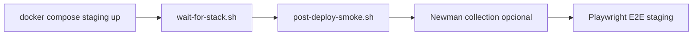

# Post-deploy tests (ENV-02)

Pruebas contra el **sistema ya desplegado** (staging), no solo el build unitario.

## Flujo



1. Levantar `docker-compose.staging.yml` + `.env.staging`
2. `scripts/wait-for-stack.sh` — API `/actuator/health` + token Keycloak (+ frontend)
3. `scripts/post-deploy-smoke.sh` — JWT / 401 / 403 / CORS (evidencia en este directorio)
4. Newman (opcional, **local**): `docs/final/ci/post-deploy-smoke.collection.json` — no se usa en CI (Sonar marca `npx` como riesgo)
5. Playwright contra `http://localhost:3008`

## Local

```bash
cp .env.staging.example .env.staging
docker compose -f docker-compose.staging.yml --env-file .env.staging up -d --build \
  postgres keycloak tempo loki alloy api frontend

API_URL=http://localhost:8088 KEYCLOAK_URL=http://localhost:8181 FRONTEND_URL=http://localhost:3008 \
  ./scripts/wait-for-stack.sh

API_URL=http://localhost:8088 KEYCLOAK_URL=http://localhost:8181 CORS_ORIGIN=http://localhost:3008 \
  ./scripts/post-deploy-smoke.sh

# Newman (opcional)
npx newman run docs/final/ci/post-deploy-smoke.collection.json \
  --env-var baseUrl=http://localhost:8088 \
  --env-var keycloakUrl=http://localhost:8181

cd frontend && npm ci && npx playwright install chromium
PLAYWRIGHT_BASE_URL=http://localhost:3008 \
API_BASE=http://localhost:8088 \
KEYCLOAK_URL=http://localhost:8181 \
KEYCLOAK_TOKEN_URL=http://localhost:8181/realms/inventory/protocol/openid-connect/token \
  npx playwright test e2e/helpers/login.spec.ts e2e/permissions.spec.ts
```

## CI

La ejecución automática vive en el job `staging-deploy-e2e` del
[pipeline principal](../../../.github/workflows/devsecops.yml):

- Trigger: `push` / `pull_request` a `develop` + `workflow_dispatch`.
- Artefacto: `post-deploy-evidence` (markdown smoke + resultados Playwright si fallan)

El workflow [`post-deploy-staging.yml`](../../../.github/workflows/post-deploy-staging.yml)
contiene el mismo flujo como respaldo aislado, pero se ejecuta **solo manualmente**
con `workflow_dispatch`.

## Nota Postgres

Si cambias `POSTGRES_PASSWORD` en `.env.staging` tras haber creado el volumen, recrea con `down -v` (password solo se aplica en el primer init del volumen).
